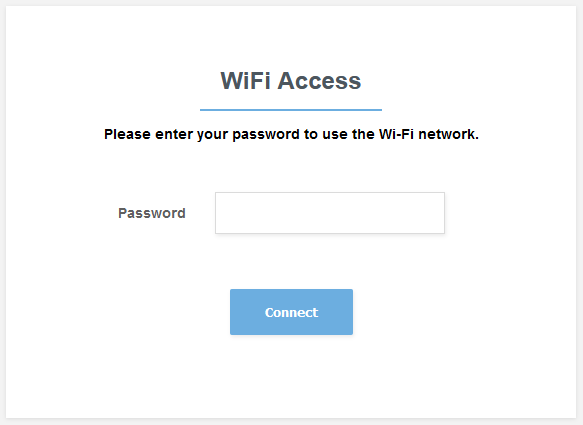

# Meraki Splash Page mapping passwordw to Group Policies
A simple NodeJS applicaiton using Express with Handlebars



## Application Install

```
git clone https://github.com/Wright-Fi/EAC-Proof-of-concept/ EAC
cd EAC
npm install
```
Open the `configs.js` file and edit the variables
```
//configs.js

// Define your Application Configurations here

var config = {
    // Meraki API Key
    apiKey: "Enter-API-Key-Here",

    // Meraki API Base URL
    apiUrl: "https://api.meraki.com/api/v1", // Updated Meraki API from V0 to V1

    // The Meraki Network ID
    networkId: "Enter-Network-ID-Here", 

    // Enter your password and corresponding Group Policy ID here
    policyMappings: {
      "Password1": "101",
      "Password2": "102",
      "Password3": "103"
  }
};

```

```
npm start
```

View the site

http://localhost:3000


## Meraki Setup
### Wireless SSID
Configure Wirless Network

Wireless --> Configure --> Access Control
- Splash Page: Click-through

### Splash Page Redirect
Wireless --> Configure --> Splash
- Custom Splash URL: http://YourPublicServerAddress:3000/

### Group Policy
Network-wide --> Configure --> Group Policies
- add Group
- Splash: Bypass


### Use Postman to get IDs
https://documenter.getpostman.com/view/897512/meraki-dashboard-prov-api/2To9xm#intro
- netID
- policyID


